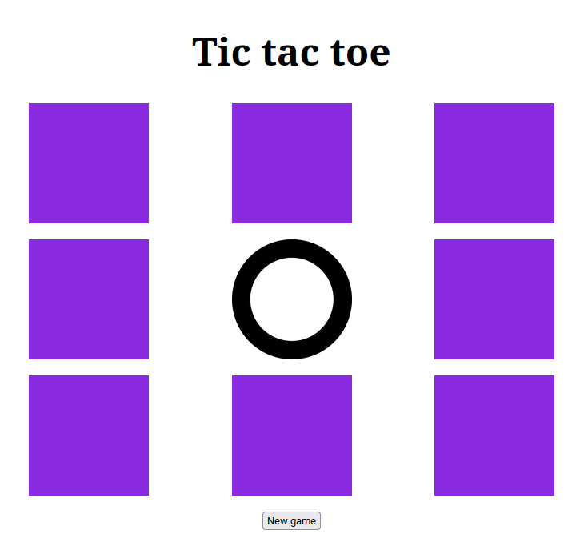

# Juego del tic-tac-toe

## Objetivo
El objetivo del ejercicio es conseguir realizar un juego completo del 3 en rayas, en su forma más simple.
Para ello, a partir del esqueleto proporcionado, será necesario implementar el resto de funcionalidad necearia para hacer el juego.

## Instrucciones
- Preparar la aplicación para que lleve el control del tablero (puede ser un arrary multidimensional, con -1, 0 y 1)
- Indicar visualmente de quien es el turno
- Cada vez que se clicke en una casilla habrá que:
  - Comprobar si esa casilla no está ya en uso (no se puede pulsar encima de una casilla ya marcada)
  - Marcar en el tablero y visualmente la jugada
  - Comprobar si la nueva jugada hace que el jugador gane la partida
  - Comprobar si la nueva jugada hace que el tablero esté lleno
  - Pasar el turno al otro oponente

## Ayuda
- Utiliza la propiedad `className` para cambiar entre X y O
- Puedes utilizar el mismo manejador para todos los cuadrados, si escribes el selector correcto
- Puedes manejar una variable global para mantener el estado del tablero e ir anotando las jugadas
- La variable del tablero puede ser un array multidimensional https://medium.com/fractions/multidimensional-arrays-in-javascript-be344f27df0e

## Rúbrica
TODO
